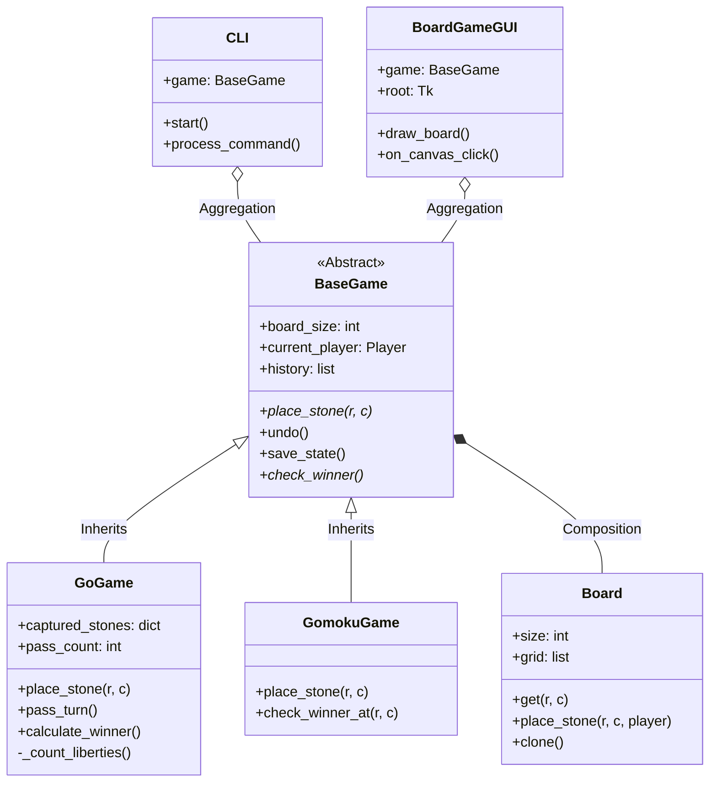
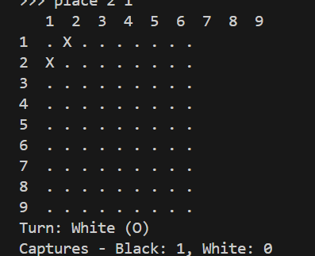

# 面向对象大作业设计文档 - 第一阶段：棋类对战平台

## 1. 设计思路与架构概览

姓名：刘超

学号：2025214236


本项目的目标是构建一个支持多种棋类游戏（目前为五子棋和围棋）的通用对战平台。设计核心遵循**面向对象编程 (OOP)** 原则，重点在于实现逻辑与界面的分离，以及保证代码的可扩展性，以便未来轻松添加新的棋类规则。

### 1.1 核心架构：逻辑与视图分离

为了满足“平台后端与客户端功能分离”的要求，系统采用了类似 MVC（Model-View-Controller）的分层架构：

- **Model (逻辑层)**：位于 `src/game/` 目录。包含棋盘状态、游戏规则（落子合法性、胜负判断）、悔棋历史管理。这部分代码不涉及任何 `print` 或 `input` 操作，确保可以被 CLI 或 GUI 任意调用。
- **View/Controller (表现与控制层)**：位于 `src/ui/` 目录。`CLI` 类和 `BoardGameGUI` 类负责处理用户输入、显示游戏状态，并调用 Model 层的方法执行操作。
- **Utils (工具层)**：位于 `src/utils/` 目录。负责通用的文件存储操作。

### 1.2 抽象与多态

为了实现“客户端可以以同样的形式对待不同的游戏类型” 2，设计了抽象基类 `BaseGame`。无论是五子棋 (`GomokuGame`) 还是围棋 (`GoGame`)，都对外暴露统一的接口（如 `place_stone`, `undo`, `check_winner`）。

## 2. 关键类设计与功能说明

### 2.1 类层次结构

#### `BaseGame` (抽象基类)

- **职责**：定义所有棋类游戏的通用行为和属性，管理游戏主循环所需的基础状态。
- **关键属性**：
  - `board`: `Board` 对象，维护棋盘网格。
  - `current_player`: 记录当前执棋方。
  - `history`: 利用**备忘录模式 (Memento Pattern)** 思想，存储每一步的棋盘快照，用于实现悔棋功能。
- **关键方法**：
  - `place_stone(row, col)`: 抽象方法，由子类实现具体的落子逻辑。
  - `undo()`: 通用的悔棋逻辑，从 `history` 栈中弹出上一个状态恢复。
  - `save_state()`: 在每次落子前保存当前状态。

#### `GoGame` (围棋实现)

- **职责**：实现围棋特有的复杂逻辑 3。
- **关键实现**：
  - **提子逻辑 (Capturing)**：在 `place_stone` 中，利用广度优先搜索 (BFS) 寻找落子点周围对手棋子的“气” (Liberties)。若气为0，则执行提子 4。
  - **禁手判断**：
    - **自杀 (Suicide)**：落子后自身无气且未提掉对手子，判定为非法 5。
    - **打劫 (Ko)**：通过对比当前棋盘与历史棋盘状态 (`_boards_equal`)，防止全局同形循环。
  - **终局计算**：`calculate_winner` 方法实现了基于“数子法/区域法”的胜负判定逻辑，通过 BFS 统计双方占据的交叉点和围住的空地 6。
  - **虚着 (Pass)**：实现了 `pass_turn`，连续两次 Pass 则触发生存判定 7。

#### `GomokuGame` (五子棋实现)

- **职责**：实现五子棋逻辑。
- **关键实现**：
  - **胜负判断**：实现了高效的 `check_winner_at` 算法。仅在当前落子点，向四个方向（横、竖、左斜、右斜）探测连续同色棋子数量，若达到5个则获胜 8。

#### `Board` (棋盘类)

- **职责**：封装二维网格数据，提供底层的坐标越界检查 (`is_within_bounds`) 和棋子存取接口。
- **设计原则**：体现了**封装**特性，外部类不直接操作二维列表，而是通过 `place_stone`/`get` 方法交互。

#### `CLI` & `BoardGameGUI` (界面类)

- **职责**：
  - `CLI`: 解析命令行指令 (`start`, `place`, `undo` 等)，捕捉 `GameError` 异常并输出友好的错误信息 9999。
  - `BoardGameGUI` (加分项): 使用 Tkinter 实现图形化界面，支持鼠标点击落子、棋盘绘制和可视化交互 10。

## 3. 面向对象设计原则与设计模式

### 3.1 设计原则体现

1. **单一职责原则 (SRP)**：
   - `Board` 只管网格数据，不管游戏规则。
   - `Player` Enum 只定义玩家类型。
   - `storage.py` 独立处理文件 I/O 11。
2. **开闭原则 (OCP)**：
   - 如果未来要增加“黑白棋 (Reversi)”，只需继承 `BaseGame` 并实现 `place_stone` 和 `check_winner`，无需修改 `CLI` 或 `GUI` 的现有代码。
3. **里氏替换原则 (LSP)**：
   - `CLI` 中使用 `self.game` 变量引用 `BaseGame` 类型，运行时无论是指向 `GoGame` 还是 `GomokuGame`，行为都能保持正确。

### 3.2 采用的设计模式

1. **模板方法模式 (Template Method)**：
   - 虽然 Python 中没有严格的 `final` 关键字，但 `BaseGame` 定义了游戏的通用流程（初始化 -> 循环 -> 切换玩家），而将具体的规则步骤（`place_stone` 中的验证逻辑）留给子类实现。
2. **备忘录模式 (Memento)**：
   - 通过 `history` 列表保存 `board.clone()` 的深拷贝对象，实现了状态的保存与恢复（悔棋功能） 12。
3. **策略模式 (Strategy)** (轻量级体现)：
   - `CLI` 根据用户输入选择不同的游戏类（策略）进行实例化。

## 4. UML 类图


使用 Mermaid 语法描述系统的类结构关系：

代码段



------


## 5. 异常处理机制

系统定义了专门的异常类 `src/game/exceptions.py` 来处理用户的不合法操作，确保程序不会崩溃 13131313。

- **`InvalidMoveError`**：
  - 落子位置超出棋盘边界 14。
  - 落子位置已有棋子。
  - 围棋：落子后无气（自杀）。
  - 围棋：触发全局同形（打劫）。
- **`InvalidBoardSizeError`**：
  - 初始化时棋盘尺寸不在 8-19 范围内 15151515。
- **处理方式**：后端抛出异常，前端 (`CLI`/`GUI`) `try-catch` 捕获并显示错误提示信息，不中断游戏进程。

## 6. 测试输入与输出结果


以下展示针对核心功能的测试用例（基于 CLI 交互）：

### 6.1 五子棋获胜测试

**输入：**

```
start gomoku 15
place 1 1
place 2 1
place 1 2
place 2 2
place 1 3
place 2 3
place 1 4
place 2 4
place 1 5
```

输出：

在最后一步 Black 落子 (1, 5) 后，系统检测到 (1,1) 至 (1,5) 连成五子。


```
Game Over! Winner: Player.BLACK
```


### 6.2 围棋提子与自杀测试

**输入：**

```
start go 9
place 1 2  (黑)
place 1 1  (白)
place 2 1  (黑)
```

输出 (提子)：

白棋 (1,1) 气尽被提。

```
   1 2 3 ...
1  . X . 
2  X . . 
Captures - Black: 1, White: 0
```

后续输入 (自杀测试)：

假设白棋尝试下在刚才被提的位置 (1,1)，且四周被黑棋包围。

输出：

```
Invalid move: Suicide move is not allowed.
```



### 6.3 存档与读档测试

**输入：**

```
place 5 5
save mygame.pkl
exit
(重新运行程序)
load mygame.pkl
```

**输出：**

```
Game loaded successfully.
(显示之前保存的棋盘状态，(5,5) 处有黑子)
```

### 6.4 悔棋测试

**输入：**

```
place 3 3
undo
```

**输出：**

```
Undid last move.
(棋盘 (3,3) 变回空白，当前执子方切回 Black)
```